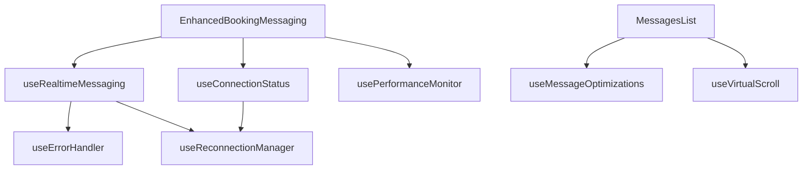

# Enhanced Real-Time Messaging System

A production-ready, real-time messaging system built for the Bright Ears platform. This system provides instant messaging with typing indicators, delivery status, pagination, error handling, and performance optimizations.

## Features

### 🚀 Real-Time Communication
- **Server-Sent Events (SSE)** for instant message delivery
- **Typing Indicators** with smart debouncing
- **Delivery Status** with read receipts (sent, delivered, read)
- **Connection Status** monitoring with reconnection logic
- **Active Users** count display

### 📱 User Experience
- **Message Pagination** with infinite scroll
- **Reply System** for threaded conversations  
- **Message Grouping** by sender and time
- **Auto-scroll** with manual scroll detection
- **Responsive Design** following Bright Ears design system
- **Accessibility** compliant components

### 🛠 Performance & Reliability
- **Error Boundaries** with automatic retry
- **Connection Resilience** with exponential backoff
- **Memory Management** with message virtualization
- **Performance Monitoring** with metrics tracking
- **Optimistic Updates** for better perceived performance

### 🎨 Design Integration
- **Design System Compliance** using only approved colors and fonts
- **Thai Localization** support
- **Mobile Responsive** layouts
- **Brand Consistency** across all components

## Architecture

### Component Structure
```
messaging/
├── components/
│   ├── MessageBubble.tsx          # Individual message display
│   ├── MessagesList.tsx           # Scrollable message container  
│   ├── MessageInput.tsx           # Message composition
│   ├── TypingIndicator.tsx        # Typing status display
│   ├── ConnectionStatus.tsx       # Connection health indicator
│   └── MessagingErrorBoundary.tsx # Error handling wrapper
├── hooks/
│   ├── useRealtimeMessaging.ts    # Core SSE messaging logic
│   ├── useConnectionStatus.ts     # Connection monitoring
│   ├── useTypingIndicator.ts      # Typing state management
│   ├── useMessagesPagination.ts   # Message loading & pagination
│   ├── useErrorHandler.ts         # Error management
│   ├── useReconnectionManager.ts  # Automatic reconnection
│   ├── useMessageOptimizations.ts # Performance optimizations
│   ├── useVirtualScroll.ts        # Virtual scrolling for large lists
│   └── usePerformanceMonitor.ts   # Performance metrics
└── EnhancedBookingMessaging.tsx   # Main container component
```

### Hook Dependencies


## Usage

### Basic Implementation
```tsx
import { EnhancedBookingMessaging } from '@/components/booking/messaging'

function BookingPage({ booking }) {
  const [showMessaging, setShowMessaging] = useState(false)

  return (
    <div>
      {/* Your booking content */}
      
      {showMessaging && (
        <EnhancedBookingMessaging
          booking={booking}
          locale="en"
          onClose={() => setShowMessaging(false)}
        />
      )}
    </div>
  )
}
```

### Custom Implementation with Individual Components
```tsx
import {
  useRealtimeMessaging,
  useConnectionStatus,
  MessagesList,
  MessageInput,
  ConnectionStatus,
  MessagingErrorBoundary
} from '@/components/booking/messaging'

function CustomMessaging({ bookingId, locale }) {
  const { connectionStatus, reconnect } = useConnectionStatus()
  
  const {
    messages,
    typingIndicators,
    sendMessage,
    setTyping,
    loadMoreMessages,
    hasMoreMessages,
    isLoading,
    error
  } = useRealtimeMessaging({ 
    bookingId,
    enabled: true 
  })

  return (
    <MessagingErrorBoundary locale={locale}>
      <div className="flex flex-col h-full">
        <ConnectionStatus
          connectionStatus={connectionStatus}
          locale={locale}
          onReconnect={reconnect}
        />
        
        <MessagesList
          messages={messages}
          typingIndicators={typingIndicators}
          locale={locale}
          onLoadMore={loadMoreMessages}
          hasMoreMessages={hasMoreMessages}
          isLoading={isLoading}
          error={error}
        />
        
        <MessageInput
          onSendMessage={sendMessage}
          onTypingChange={setTyping}
          locale={locale}
          disabled={!connectionStatus.isConnected}
        />
      </div>
    </MessagingErrorBoundary>
  )
}
```

## API Integration

The messaging system integrates with these API endpoints:

### Required Endpoints
- `GET /api/messages/stream/[bookingId]` - SSE connection for real-time updates
- `POST /api/messages/typing/[bookingId]` - Typing indicator updates
- `GET /api/bookings/[id]/messages` - Message history with pagination
- `POST /api/bookings/[id]/messages` - Send new messages

### Message Data Structure
```typescript
interface Message {
  id: string
  content: string
  messageType: 'TEXT' | 'IMAGE' | 'FILE' | 'SYSTEM'
  attachmentUrl?: string
  createdAt: string
  isRead: boolean
  readAt?: string
  deliveredAt?: string
  deliveryStatus: 'SENT' | 'DELIVERED' | 'READ'
  parentMessage?: {
    id: string
    content: string
    senderName: string
  }
  sender: {
    id: string
    name: string
    email: string
    role: string
    profileImage?: string
  }
  isOwn: boolean
}
```

## Configuration

### Connection Settings
```typescript
const connectionConfig = {
  maxReconnectAttempts: 10,
  initialRetryDelay: 1000,    // 1 second
  maxRetryDelay: 30000,       // 30 seconds
  backoffFactor: 1.5,
  jitterRange: 0.3
}
```

### Performance Settings
```typescript
const performanceConfig = {
  messageGroupingThreshold: 5, // minutes
  virtualScrollOverscan: 3,    // items
  maxCachedMessages: 1000,
  typingDebounceMs: 1000,
  metricsUpdateInterval: 5000  // 5 seconds
}
```

## Styling & Theming

The components strictly follow the Bright Ears design system:

### Colors Used
- `brand-cyan` (#00bbe4) - Primary actions, links
- `pure-white` (#ffffff) - Message bubbles, cards
- `dark-gray` (#333333) - Text content
- `earthy-brown` (#a47764) - Secondary buttons
- `off-white` (#f7f7f7) - Backgrounds

### Typography
- `font-playfair` - All headlines (h1, h2, h3)
- `font-inter` - Body text, UI elements (default)
- `font-noto-thai` - Thai content only

## Performance Optimizations

### Memory Management
- Automatic message cleanup for old conversations
- Efficient message grouping and caching
- Virtual scrolling for large message lists
- Debounced typing indicators

### Network Efficiency
- SSE connection reuse and reconnection logic
- Optimistic message updates
- Intelligent message pagination
- Connection health monitoring

### Rendering Optimization
- React.memo for all components
- Optimized re-rendering with dependency arrays
- Message position caching
- Intersection Observer for scroll detection

## Error Handling

### Connection Errors
- Automatic reconnection with exponential backoff
- Visual feedback for connection issues  
- Graceful degradation when offline
- Error boundary with recovery options

### Message Errors
- Retry mechanisms for failed messages
- Visual indicators for delivery status
- Error logging and user feedback
- Fallback UI components

## Accessibility

### Features
- Keyboard navigation support
- Screen reader compatibility
- Focus management for modal dialogs
- ARIA labels and roles
- Color contrast compliance

### Testing
Components are tested for:
- Keyboard accessibility
- Screen reader compatibility
- Focus trap in modal
- Color contrast ratios

## Browser Support

### Modern Browsers
- Chrome 88+
- Firefox 85+
- Safari 14+
- Edge 88+

### Features Used
- Server-Sent Events (SSE)
- IntersectionObserver API
- Performance API
- Modern JavaScript (ES2020)

## Development

### Local Setup
1. Ensure all API endpoints are running
2. Configure environment variables
3. Install dependencies: `npm install`
4. Start development server: `npm run dev`

### Testing
```bash
# Unit tests
npm run test

# Integration tests
npm run test:integration

# E2E tests
npm run test:e2e
```

### Performance Monitoring
```typescript
import { usePerformanceMonitor } from '@/components/booking/messaging'

const { metrics, getPerformanceReport } = usePerformanceMonitor({
  onMetricsUpdate: (metrics) => {
    if (metrics.messageRenderTime > 100) {
      console.warn('Slow message rendering detected')
    }
  }
})

// Export performance report for analysis
console.log(getPerformanceReport())
```

## Migration Guide

### From Legacy BookingMessaging
1. Replace `BookingMessaging` import with `EnhancedBookingMessaging`
2. Update props if needed (interface is backward compatible)
3. Verify API endpoints are configured correctly
4. Test real-time functionality

### Breaking Changes
- Removed polling-based message fetching
- Updated message data structure with delivery status
- Connection status now required prop
- Error boundaries are now mandatory

## Troubleshooting

### Common Issues

**SSE Connection Fails**
- Check CORS settings on server
- Verify authentication headers
- Ensure endpoint returns proper SSE format

**Messages Not Appearing**
- Check network connectivity
- Verify SSEManager is broadcasting correctly
- Check browser console for errors

**Performance Issues**
- Enable virtual scrolling for large conversations
- Check memory usage in performance monitor
- Reduce message grouping threshold

**Styling Issues**
- Ensure design system classes are available
- Check Tailwind configuration
- Verify font loading

### Debug Mode
```typescript
// Enable debug logging
localStorage.setItem('messaging-debug', 'true')

// View connection info
console.log(SSEManager.getConnectionInfo())

// Export performance data
console.log(usePerformanceMonitor().export())
```

## Contributing

Please follow these guidelines when contributing:

1. Maintain design system compliance
2. Add comprehensive error handling
3. Include TypeScript types
4. Write unit tests for new features
5. Update documentation
6. Follow accessibility standards

## License

This messaging system is part of the Bright Ears platform and follows the project's licensing terms.